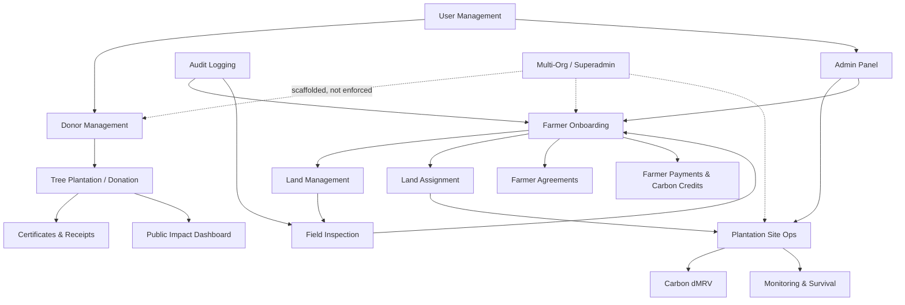

# Business Modules — JITO Green Legacy Platform

> How each functional module works today and how it interacts with the others, based on the actual pages, API routes, and Prisma models found in the repository.

## Module Map

## 1. Donor Management & Tree Plantation (Donation)

**What it does**: The core fundraising flow. A visitor picks a campaign (or an individual tree count) on `/donate`, the frontend calls `POST /api/payment/create-order` to create a `PENDING` `Donation` + Razorpay order, completes checkout via the Razorpay JS SDK, and `POST /api/payment/verify` (plus the redundant `POST /api/payment/webhook` for server-side confirmation) marks the donation `COMPLETED`, creates one `Tree` row per sponsored tree, generates a receipt number/ref ID, and fires off a confirmation email.

**Models**: `Campaign`, `Donation`, `Tree`, `Receipt`, `Certificate`.

**Interactions**: Feeds the **Certificates & Receipts** module (auto-generates both on completion) and the **Public Impact Dashboard** (aggregates `Donation`/`Tree` counts). Admins can also bypass the donor flow entirely and create/edit/delete donations manually via `/admin/donations` (`POST/PATCH/DELETE /api/admin/donations`, plus `/api/admin/donations/bulk` for CSV import) — this exists to record cash/bank-transfer/cheque contributions collected offline by JITO chapters.

**Notable characteristic**: Payment verification (`/api/payment/verify`) trusts a client-supplied `donationId` without cross-checking it against the order that was actually paid for — see [CODE_REVIEW.md](CODE_REVIEW.md) for the integrity concern this raises.

## 2. Certificates & Receipts

**What it does**: On successful payment, `pdf.ts`'s `generateReceiptPDF`/`generateCertificatePDF` render fixed HTML templates (embedding base64 JITO/Environment/Mumbai-Zone logos) that are served at `GET /api/receipts/[id]/pdf` and `GET /api/certificates/[id]/pdf` for the browser to print-to-PDF (they return HTML, not a binary PDF, despite the route name). A tiered badge system (Diamond/Platinum/Gold/Silver Legacy, in Hindi + English) is computed from tree count.

**Models**: `Receipt`, `Certificate` (1:1 with `Donation`).

**Interactions**: Downstream of Donation Management. The farmer-side equivalent is the separate **Farmer Agreements** module (different templates, different lifecycle).

**Notable characteristic**: Both endpoints are fully public with no ownership check — anyone with a donation ID can view another donor's name, PAN, and dedication details (see [CODE_REVIEW.md](CODE_REVIEW.md)).

## 3. Farmer Onboarding & Land Management

**What it does**: A landowner self-registers via mobile+OTP (`/farmer/register`, backed by `/api/farmer/otp` and `/api/farmer/register`), moving through an 8-step wizard (mobile → OTP → personal → bank → land → ownership → plantation preference → nominee → consent) with progress auto-saved every 30s to both `localStorage` and the `Farmer.draftData`/`registrationStep` DB fields. Farmers then register one or more `Land` parcels (survey/khata numbers, GPS + GeoJSON polygon, water/security/ownership status) and upload KYC documents (Aadhaar, PAN, 7/12 extract, cancelled cheque, etc.) via `/farmer/documents`.

**Models**: `Farmer`, `Land`, `FarmerDocument`.

**Interactions**: Feeds **Field Inspection** (a `FieldOfficer` must verify the farmer/land before it can be assigned to a site) and, once approved, **Land Assignment** into a `PlantationSite`.

**Notable characteristic**: The farmer's own portal (`/farmer/dashboard`, `/farmer/land`, `/farmer/documents`) authenticates via an unsigned base64 "token" stored in `localStorage`, entirely separate from the NextAuth system used for donors/admins — and no API route actually verifies that token against the `farmerId` supplied in each request (see [CODE_REVIEW.md](CODE_REVIEW.md) — this is the most significant security gap in the codebase).

## 4. Field Inspection

**What it does**: A `FieldOfficer` (own login system — email+password, not NextAuth, not localStorage-token either; a *third* distinct identity system) physically visits a farmer's land and submits a `SiteInspection` via `POST /api/field-officer/inspect` — a checklist (ownership verified, boundary verified, farmer met personally, plantation feasible, water source available) plus GPS and photos. Completing an inspection can transition the farmer's status (`FarmerStatus`) toward `APPROVED`.

**Models**: `FieldOfficer`, `SiteInspection`.

**Interactions**: Gatekeeper between Farmer Onboarding and Land Assignment. Writes to `AuditLog`.

**Notable characteristic**: `/api/field-officer/inspect` has no authentication at all — it trusts an `officerId` field in the request body, meaning any client can forge an inspection report or audit entry attributed to any officer. Also, **there is no frontend UI at all for field officers** (`src/app/field-officer/` has no `page.tsx`) — the role and its one API route exist, but there is nothing for a field officer to actually log into and use.

## 5. Land Assignment & Plantation Site Operations

**What it does**: An admin assigns a farmer's approved `Land` to a `PlantationSite` via `LandAssignment` (tracked stage: `ASSIGNED → ... `, tree counts planned/planted/surviving, species allocation, consent). This is the bridge between the farmer-onboarding side of the platform and the donor/plantation-site side — a `PlantationSite` is also where donor-sponsored `Tree` records eventually get geo-tagged and linked. Admins manage sites at `/admin/plantation-sites` (a 4-step creation wizard that auto-estimates carbon credits from tree count × survival % × a fixed 0.022 tCO2/tree/year factor × 25-year crediting period) and drill into a 6-tab per-site dashboard (`/admin/plantation-sites/[id]`) covering assignments, field activities, monitoring visits, timeline, and documents.

**Models**: `MasterProject`, `PlantationSite`, `SpeciesPlan`, `LandAssignment`, `LandStageHistory`, `PlantationActivity`, `TimelineEvent`, `SiteDocument`, `SiteNotification`.

**Interactions**: Consumes farmers/land from the Onboarding module; feeds the **Carbon dMRV** and **Monitoring** modules; its aggregate stats appear on the admin dashboard and (in a hardcoded, non-DB-driven form) on the public `/impact` page.

**Notable characteristic**: Half of the site sub-routes (GET on site detail, dashboard, activities, assignments, documents, monitoring) have **no authentication check at all**, exposing farmer names, mobile numbers, and GPS coordinates publicly; the other half (POST/PATCH on the same resources) only check for *any* logged-in session, not a specific role — a donor account could technically log a plantation activity or edit a site.

## 6. Monitoring & Survival Tracking

**What it does**: Periodic `MonitoringVisit` records (survival count, dead trees, disease notes, average height, GPS, photos) are logged against a site (and optionally a specific `LandAssignment`) via `/admin/plantation-sites/[id]` → Monitoring tab. Survival/mortality percentages are computed both here and separately in the per-site dashboard route (duplicated calculation logic).

**Models**: `MonitoringVisit`.

**Interactions**: Rolls up into the Plantation Site dashboard and (conceptually, though not yet wired) the Carbon dMRV module's survival-rate inputs.

## 7. Carbon dMRV (Digital Measurement, Reporting & Verification)

**What it does**: The `CarbonMonitoring` model captures methodology (Verra VM0047, Gold Standard, etc.), crediting period, vintage, baseline/additionality/leakage/buffer-pool figures, registry status, and issued/pending credit totals per site. The admin UI for this is the 9-page `/admin/dmrv/*` module (Dashboard, Measure, Monitor, Report, Verify, Carbon Estimation, Evidence Vault, Audit Trail, AI Alerts, Readiness), styled with its own independent dark theme (`DMRVLayout`) unrelated to the tenant's white-label colors.

**Current implementation state — important for planning purposes**: Only 2 of the 9 pages (Dashboard, Readiness) render non-trivial UI, and **both use fully hardcoded mock data arrays**, not the real `CarbonMonitoring`/`PlantationSite` Prisma data. The remaining 6 pages (Monitor, Report, Verify, Carbon Estimation, Evidence Vault, Audit Trail, AI Alerts) are byte-for-byte identical placeholder templates showing only an empty state. This entire module is best understood as a **UI/UX prototype for a not-yet-built feature**, disconnected from the otherwise-functional plantation-site data model.

**Models**: `CarbonMonitoring` (schema exists; no route in `src/app/api` currently reads or writes it — confirmed no `carbonMonitoring` Prisma calls found in any of the 39 API routes reviewed).

**Interactions**: Intended to consume data from Monitoring & Survival Tracking and Plantation Site Operations; not yet integrated in practice.

## 8. Farmer Agreements (Legal Documents)

**What it does**: Generates five distinct HTML→PDF legal documents for farmers — Landowner Participation Agreement, Joint-Owner NOC (bilingual Hindi), Payment Receipt, Sapling Receipt, and Plantation Completion Certificate — via `doc-templates.ts`, orchestrated through `/api/admin/agreements` (admin generates) and `/api/farmer/agreements` (farmer views/acknowledges/uploads a signed copy). Each document moves through a status lifecycle: `GENERATED → SHARED → ACKNOWLEDGED → SIGNED → COMPLETED`.

**Models**: `FarmerAgreement`.

**Interactions**: Depends on Farmer Onboarding data (name, land, bank details) to populate templates; is the farmer-side analogue of the donor-side Certificates module, but with a materially different (and more complex) lifecycle and no shared code between the two template systems (`pdf.ts` vs `doc-templates.ts`).

**Notable characteristic**: `GET /api/admin/agreements` has an auth check whose failure is silently swallowed, making the list effectively public; `GET /api/farmer/agreements/[id]` (the printable HTML render, containing Aadhaar numbers and survey details) has no auth at all.

## 9. Farmer Payments & Carbon Credits

**What it does**: `FarmerPayment` records incentive/revenue disbursements to farmers (plantation incentive, maintenance incentive, carbon revenue share, CSR payment). `CarbonCredit` tracks credits issued/sold per farmer with vintage year and registry serial number.

**Models**: `FarmerPayment`, `CarbonCredit`.

**Interactions**: Conceptually downstream of Carbon dMRV (credits generated from verified sites should translate into farmer revenue share), but **no API route in the current codebase creates, updates, or lists either model** — both are schema-only, unimplemented in the application layer. The farmer profile's own "stats" endpoint (`GET /api/farmer/profile`) even hardcodes `totalRevenue: 0` and `totalCO2: 0` rather than aggregating from these tables.

## 10. User Management

**What it does**: Two entirely separate user-management surfaces:
1. **Web users** (`User` model — donors, admins, super admins) — managed at `/admin/people` via `/api/admin/users` (create, edit, toggle active/lock, reset password, change role, soft-delete).
2. **Farmers** and **Field Officers** — managed at `/admin/farmers` (`/api/admin/farmers`) and seeded directly (no farmer-officer management UI beyond assignment).

**Models**: `User`, `Farmer`, `FieldOfficer`.

**Interactions**: Gatekeeper for all role-gated modules via NextAuth (`User.role`) and middleware; Farmers/FieldOfficers sit outside this gate entirely (see Auth & Authorization doc in [SYSTEM_ARCHITECTURE.md](SYSTEM_ARCHITECTURE.md)).

## 11. Audit Logging

**What it does**: A single generic `AuditLog` table (actor, role, action, JSON details, IP, optional farmer link) records administrative and field actions. It is also repurposed as the storage for the public **Contact Us** form submissions (`/api/contact`), which is a schema smell — contact inquiries aren't actions taken *on* a farmer, but they're stored in the farmer-audit table for lack of a dedicated model.

**Models**: `AuditLog`.

**Interactions**: Written to by Field Inspection, Farmer status changes, and Contact form submissions; read by `/admin/logs`.

## 12. Public Impact / Transparency Dashboard

**What it does**: `/impact` (a server component with `revalidate=60`) shows live-ish aggregate stats (`prisma.donation.aggregate`, `prisma.tree.groupBy`, `prisma.user.count`) alongside a **hardcoded array of named plantation sites with real farmer names and GPS coordinates** — this duplicates data the real `PlantationSite` model already stores (used by the admin plantation-sites pages) instead of querying it.

**Models**: Reads `Donation`, `Tree`, `User` in aggregate; the site list is not DB-driven at all.

**Interactions**: Downstream of Donation Management and (in principle, though not implemented) Plantation Site Operations.

## 13. CSR Inquiry

**What it does**: `/csr` presents a corporate-partnership pitch and a lead-capture form (`POST /api/csr-inquiry`). **This module is not actually implemented** — the API route accepts any JSON body with no validation and only logs it to the server console; nothing is saved or emailed, though the UI reports success to the visitor.

**Models**: None (no persistence).

## 14. Superadmin / Multi-Org Management (SaaS Scaffold)

**What it does**: `/sadmin/*` (separately branded "BNZ Green Technologies," gated by a `SUPER_ADMIN`-only `withSuperAdmin()` HOC + role check) lets a platform operator create/list/toggle organizations (`/sadmin/orgs`, backed by `/api/superadmin/orgs*`) with full white-label config (name, slug, plan, primary color, tree price, ID prefixes, custom domain, 80G number). Four of the six `/sadmin/*` sub-pages (Users, Plans, Billing, Analytics) plus Settings are identical placeholder templates with no real functionality yet.

**Models**: `Organization`.

**Interactions**: This is the intended control plane for turning the platform multi-tenant, but as documented throughout [API_DOCUMENTATION.md](API_DOCUMENTATION.md) and [CODE_REVIEW.md](CODE_REVIEW.md), almost none of the other 13 modules above actually filter their data by the `orgId` this module manages — creating a second organization today would let its admins see and edit the first organization's farmers, donations, and sites. See [SAAS_MIGRATION_PLAN.md](SAAS_MIGRATION_PLAN.md) for the remediation plan.

## Cross-Module Dependency Summary

| Module | Depends on | Feeds into |
|---|---|---|
| Donor Management | Campaign config | Certificates & Receipts, Impact Dashboard |
| Certificates & Receipts | Donor Management | — (terminal) |
| Farmer Onboarding | — | Field Inspection, Land Assignment |
| Field Inspection | Farmer Onboarding | Land Assignment (status gate) |
| Land Assignment / Site Ops | Farmer Onboarding, Field Inspection | Monitoring, Carbon dMRV (intended), Admin Dashboard, Impact Dashboard (currently bypassed) |
| Monitoring | Land Assignment | Site dashboards |
| Carbon dMRV | Site Ops, Monitoring (intended, not wired) | Farmer Payments/Carbon Credits (intended, not implemented) |
| Farmer Agreements | Farmer Onboarding | — (terminal, legal record) |
| Farmer Payments / Carbon Credits | Carbon dMRV (intended, not wired) | Farmer profile stats (currently hardcoded to 0) |
| User Management | — | Every role-gated module |
| Audit Logging | Field Inspection, Farmer status changes, Contact form | `/admin/logs` |
| Superadmin / Multi-Org | — | Intended to scope every other module; currently does not |
