# Database Documentation — JITO Green Legacy Platform

> Analysis based on `prisma/schema.prisma`, `prisma/migrations/20260523143756_init/migration.sql`, `FARMER_MODULE_SQL.sql`, and `prisma/seed.ts` as they exist in the repository on the analysis date. No code was modified to produce this document.

## 1. Overview

- **ORM**: Prisma Client 5.22.0
- **Database**: PostgreSQL (target: Supabase, via PgBouncer transaction pooler on port 6543)
- **Schema file**: [prisma/schema.prisma](prisma/schema.prisma) — 26 models, 15 enums, ~920 lines
- **ID strategy**: `cuid()` string primary keys everywhere (no auto-increment integers, no UUID type — all `TEXT`/`String`)
- **Migration state**: **Only one migration exists** — `20260523143756_init` — which reflects the *original* MVP schema (Users, Accounts, Sessions, Campaigns, Donations, Trees, PlantationSite (basic), Receipts, Certificates). Everything added since then (Organization, Farmer module — 13 models, DMRV/plantation-site enhancements) has **no corresponding migration file**. `FARMER_MODULE_SQL.sql` is a hand-written script described as "Run this in Supabase SQL Editor" — i.e., schema changes were applied directly to the database out-of-band rather than through `prisma migrate`. This is a significant risk; see [CODE_REVIEW.md](CODE_REVIEW.md).

## 2. Model Inventory

### 2.1 Identity / Auth (NextAuth-owned)
| Model | Purpose |
|---|---|
| `User` | Donor/admin/staff account. Roles via `Role` enum. Soft-delete fields (`deletedAt`, `deletedById`, `deleteReason`). Login lockout fields (`isLocked`, `loginAttempts`). OTP-based password reset (`resetOtpHash`, `resetOtpExpiry`). Linked to `Organization` via optional `orgId`. |
| `Account` | NextAuth OAuth account link (Prisma Adapter standard table). Only Credentials provider is actually configured in `auth.ts`, so this table is present but effectively unused for OAuth today. |
| `Session` | NextAuth DB session table — unused in practice since `session: { strategy: 'jwt' }` is set in `auth.ts`; JWT sessions don't write to this table. |
| `VerificationToken` | NextAuth standard table, unused (no email-verification flow implemented). |

### 2.2 Donation / Campaign Domain (core JITO business)
| Model | Purpose |
|---|---|
| `Campaign` | A themed donation campaign (e.g. "Maa", "Dadi"). Has `treePrice`, `goal`, `active`, optional `orgId`. |
| `Donation` | Central donation record. Payment lifecycle (`paymentStatus`, `paymentGatewayId`, `paymentOrderId`), manual-entry support (`paymentMode`, `paymentBank`, `paymentBranch`, `chequeNumber` — for cash/bank-transfer/cheque donations entered by admin), WhatsApp/email/80G tracking flags, `refId` (auto ref like `#JITO-00001`), `createdById` (admin who manually added). Optional `orgId`. |
| `Tree` | Individual tree record linked to a `Donation`, with geo-tag (`geoLatitude/geoLongitude`), `treeTagId`, `status` (PENDING/PLANTED/GROWING/MATURE), `expectedCO2`, optional link to `PlantationSite`. |
| `Receipt` | 1:1 with `Donation` — stores generated receipt PDF URL. |
| `Certificate` | 1:1 with `Donation` — stores generated certificate PDF URL. |

### 2.3 Plantation Site / Carbon MRV Domain
| Model | Purpose |
|---|---|
| `MasterProject` | Top-level named project (e.g. "JITO Green Legacy") grouping multiple `PlantationSite`s. Optional `orgId`. |
| `PlantationSite` | Rich site record: location (state/district/taluka/village/GPS/GeoJSON polygon), team (field officer, supervisor, carbon consultant, auditor, nursery), planned vs. actual targets (trees, area, carbon, survival), budget. Optional `orgId`, optional `projectId`. |
| `SpeciesPlan` | Planned species mix per site (qty, nursery source, survival %, carbon factor). |
| `LandAssignment` | Links a `Farmer`'s `Land` to a `PlantationSite` — the join between the farmer-onboarding module and the plantation-site/donor module. Tracks lifecycle `stage`, tree counts, consent, Drive photo links. |
| `LandStageHistory` | Append-only audit trail of `LandAssignment` stage transitions with photos. |
| `PlantationActivity` | Logged field activity (pit digging, sapling delivery, irrigation, monitoring, etc.) against a site. |
| `MonitoringVisit` | Periodic survival/health check visit — survival count, dead trees, GPS, photos. |
| `CarbonMonitoring` | Carbon-credit methodology and registry tracking per site (Verra/Gold Standard, vintage, baseline, additionality, leakage, buffer pool, issued/pending credits). This is the "dMRV" (digital Measurement, Reporting & Verification) data model backing `/admin/dmrv/*`. |
| `TimelineEvent` | Free-form event log per site (for a visual timeline UI). |
| `SiteDocument` | Versioned file attachments per site, organized into folders. |
| `SiteNotification` | In-app alert/notification tied to a site (severity, read flag). |

### 2.4 Farmer Onboarding & Land Module
| Model | Purpose |
|---|---|
| `Farmer` | Landowner/farmer account — mobile+OTP auth (separate from `User`/NextAuth), KYC (Aadhaar/PAN), bank details, nominee details, multi-step registration (`registrationStep`, `draftData` JSON autosave), generated IDs (`farmerIdGenerated`, `gisId`), status workflow (`FarmerStatus`), soft delete. Optional `orgId`, optional `assignedOfficerId` → `FieldOfficer`. |
| `FieldOfficer` | Staff who inspects/onboards farmers. Own credential pair (email+password), not part of `User`/Role system. |
| `Land` | A land parcel owned by a `Farmer` — survey/khata numbers, area, GPS + GeoJSON polygon, water/security/ownership status, species/plantation preference. |
| `FarmerDocument` | KYC/consent/plantation document uploads per farmer/land, with verification workflow (`DocStatus`). |
| `SiteInspection` | A `FieldOfficer`'s physical inspection of a farmer's land — checklist booleans, GPS, photos, PDF report. |
| `Plantation` | Farmer-side plantation record (distinct from the donor-side `Tree`/`PlantationSite` — this is the plantation actually carried out on a farmer's own `Land`, independent of donations). |
| `FarmerPayment` | Incentive/revenue payment to a farmer (`PaymentType`: plantation incentive, maintenance incentive, carbon revenue, CSR payment). |
| `CarbonCredit` | Carbon credits issued/sold against a farmer's plantation, with registry serial number. |
| `AuditLog` | Generic action log — actor, role, action, JSON details, IP — attached optionally to a farmer. |
| `FarmerAgreement` | Generated legal documents (participation agreement, plantation certificate, sapling receipt, NOC, etc.) with a HTML→PDF→signed-PDF lifecycle (`GENERATED → SHARED → ACKNOWLEDGED → SIGNED → COMPLETED`). |

### 2.5 Multi-Tenancy Scaffold
| Model | Purpose |
|---|---|
| `Organization` | **Tenant record** — already present, currently used by exactly one seeded row representing JITO (`org_jito_mumbai`, referenced as a hardcoded constant in `src/lib/tenant.ts`). Fields: branding (`primary_color`, `logo_url`), contact info, ID prefixes (`farmer_id_prefix`, `donation_ref_prefix`), `tree_price`, `org_80g_number`, `campaign_config` (JSON), `payment_banks` (JSON), `custom_domain` (unique), `plan`, `active`. Has `orgId`-based relations to `User`, `Campaign`, `Donation`, `Farmer`, `PlantationSite`, `MasterProject` — but **not** to `Tree`, `Land`, `FieldOfficer`, `LandAssignment`, `FarmerPayment`, `CarbonCredit`, `AuditLog`, `Receipt`, `Certificate`, or any of the DMRV models (`SpeciesPlan`, `PlantationActivity`, `MonitoringVisit`, `CarbonMonitoring`, `TimelineEvent`, `SiteDocument`, `SiteNotification`). This is the single most important gap for multi-tenancy (see [SAAS_MIGRATION_PLAN.md](SAAS_MIGRATION_PLAN.md)). |

## 3. Enums

| Enum | Values |
|---|---|
| `Role` | DONOR, ADMIN, SUPER_ADMIN, FIELD_OFFICER, DATA_ENTRY, PROJECT_MANAGER, AUDITOR |
| `PaymentStatus` | PENDING, COMPLETED, FAILED, REFUNDED |
| `DedicationType` | MOTHER, FATHER, GRANDPARENTS, DAUGHTER, MEMORIAL, CSR, OTHER |
| `TreeStatus` | PENDING, PLANTED, GROWING, MATURE |
| `Gender` | MALE, FEMALE, OTHER |
| `FarmerStatus` | REGISTERED, DOCUMENTS_PENDING, DOCUMENTS_VERIFIED, INSPECTION_PENDING, INSPECTION_COMPLETED, APPROVED, ACTIVE, SUSPENDED |
| `LandType` | AGRICULTURAL, PRIVATE, WASTELAND, AGROFORESTRY, ORCHARD, COMMUNITY |
| `PlantationType` | AGROFORESTRY, MIYAWAKI, NATIVE_FOREST, FRUIT_TREES, BAMBOO, MIXED_SPECIES |
| `DocumentType` | AADHAAR, PAN, LAND_7_12, LAND_RECORD, PROPERTY_TAX, OWNERSHIP_PROOF, CONSENT_LETTER, CANCELLED_CHEQUE, PLANTATION_PHOTO, JOINT_OWNER_NOC, PARTICIPATION_AGREEMENT, PLANTATION_CERTIFICATE, SAPLING_RECEIPT, PAYMENT_RECEIPT, SIGNED_AGREEMENT, SIGNED_NOC, OTHER |
| `DocStatus` | PENDING, VERIFIED, REJECTED |
| `InspectionStatus` | SCHEDULED, IN_PROGRESS, COMPLETED, CANCELLED |
| `PlantationStatus` | PLANNED, IN_PROGRESS, COMPLETED, MONITORING, COMPLETED_VERIFIED |
| `PaymentType` | PLANTATION_INCENTIVE, MAINTENANCE_INCENTIVE, CARBON_REVENUE, CSR_PAYMENT |
| `CreditStatus` | PENDING, ISSUED, SOLD, RETIRED |

Note several free-text `String` fields duplicate what should be enums (technical debt, see CODE_REVIEW.md): `PlantationSite.currentPhase`, `PlantationActivity.activityType`, `CarbonMonitoring.registryStatus`, `SiteNotification.type`/`severity`, `LandAssignment.stage`, `Donation.paymentMode`, `FarmerAgreement.agreementType`/`status`.

## 4. Entity-Relationship Diagram

```mermaid
erDiagram
    ORGANIZATION ||--o{ USER : "orgId (optional)"
    ORGANIZATION ||--o{ CAMPAIGN : "orgId (optional)"
    ORGANIZATION ||--o{ DONATION : "orgId (optional)"
    ORGANIZATION ||--o{ FARMER : "orgId (optional)"
    ORGANIZATION ||--o{ PLANTATION_SITE : "orgId (optional)"
    ORGANIZATION ||--o{ MASTER_PROJECT : "orgId (optional)"

    USER ||--o{ DONATION : "makes"
    USER ||--o{ ACCOUNT : "has"
    USER ||--o{ SESSION : "has"

    CAMPAIGN ||--o{ DONATION : "receives"
    DONATION ||--o{ TREE : "produces"
    DONATION ||--|| RECEIPT : "generates"
    DONATION ||--|| CERTIFICATE : "generates"

    MASTER_PROJECT ||--o{ PLANTATION_SITE : "contains"
    PLANTATION_SITE ||--o{ TREE : "hosts"
    PLANTATION_SITE ||--o{ SPECIES_PLAN : "plans"
    PLANTATION_SITE ||--o{ LAND_ASSIGNMENT : "assigns"
    PLANTATION_SITE ||--o{ PLANTATION_ACTIVITY : "logs"
    PLANTATION_SITE ||--o{ MONITORING_VISIT : "monitors"
    PLANTATION_SITE ||--o{ CARBON_MONITORING : "tracks"
    PLANTATION_SITE ||--o{ TIMELINE_EVENT : "records"
    PLANTATION_SITE ||--o{ SITE_DOCUMENT : "stores"
    PLANTATION_SITE ||--o{ SITE_NOTIFICATION : "alerts"

    FARMER ||--o{ LAND : "owns"
    FARMER ||--o{ FARMER_DOCUMENT : "uploads"
    FARMER ||--o{ PLANTATION : "plants"
    FARMER ||--o{ LAND_ASSIGNMENT : "assigned to site"
    FARMER ||--o{ FARMER_PAYMENT : "receives"
    FARMER ||--o{ SITE_INSPECTION : "inspected"
    FARMER ||--o{ AUDIT_LOG : "actions logged"
    FARMER ||--o{ CARBON_CREDIT : "earns"
    FARMER ||--o{ FARMER_AGREEMENT : "signs"
    FIELD_OFFICER ||--o{ FARMER : "assigned officer"
    FIELD_OFFICER ||--o{ SITE_INSPECTION : "performs"

    LAND ||--o{ FARMER_DOCUMENT : "documented"
    LAND ||--o{ PLANTATION : "planted on"
    LAND ||--o{ LAND_ASSIGNMENT : "assigned"
    LAND ||--o{ SITE_INSPECTION : "inspected"
    LAND_ASSIGNMENT ||--o{ LAND_STAGE_HISTORY : "history"
    LAND_ASSIGNMENT ||--o{ MONITORING_VISIT : "monitored"
```

*(Simplified — omits NextAuth `VerificationToken`, which has no relations.)*

## 5. Indexes & Constraints

- **Unique constraints**: `User.email`, `Campaign.slug`, `Donation.receiptNumber`, `Donation.refId`, `Tree.treeTagId`, `Receipt.donationId`, `Certificate.donationId`, `Organization.slug`, `Organization.custom_domain`, `Farmer.mobile`, `Farmer.aadhaarNumber`, `Farmer.farmerIdGenerated`, `Farmer.gisId`, `FieldOfficer.email`, `FieldOfficer.mobile`, `FieldOfficer.employeeId`, `MasterProject.code`, `PlantationSite.siteCode`, `Account.[provider, providerAccountId]`, `Session.sessionToken`, `VerificationToken.token` and `[identifier, token]`, `LandAssignment.[siteId, landId]`.
- **No composite/query-optimization indexes are declared anywhere** beyond what unique constraints imply (Prisma does not auto-add non-unique indexes on foreign keys by default in this schema — no explicit `@@index` blocks exist in `schema.prisma`). Given filtering that will become common in a multi-tenant setup (`WHERE orgId = ...`), the absence of an index on any `orgId` column is a real performance risk once tenant count and row volume grow — see CODE_REVIEW.md.
- **Cascade rules**: Only `Account.userId` and `Session.userId` cascade on delete (NextAuth defaults). Every other relation (`Donation.userId`, `Tree.donationId`, `Tree.siteId`, all `Organization` back-relations, all `Farmer`/`Land` relations) has **no explicit `onDelete` behavior specified** in `schema.prisma`, so Prisma defaults to `Restrict` for required relations. This means, e.g., an `Organization` cannot be deleted while any `User`/`Campaign`/`Donation`/`Farmer` row still references it — acceptable for tenant safety, but not an intentional design decision documented anywhere.
- **JSON columns** (schema-less, no validation at the DB layer): `PlantationSite.geoData`, `LandAssignment.speciesAlloc`/`speciesPlanted`, `PlantationActivity.speciesPlanted`, `Plantation.gpsCoordinates`, `Land.polygonGeoJson`, `Organization.campaign_config`/`payment_banks`, `Farmer.draftData`, `AuditLog.details`, `FarmerAgreement.templateData`.

## 6. Data Flow (Donation Lifecycle)

1. Donor submits form on `/donate` → `POST /api/payment/create-order` creates a `Donation` row (`PENDING`) + Razorpay order.
2. Razorpay checkout completes client-side → `POST /api/payment/verify` validates the HMAC signature, marks `Donation.paymentStatus = COMPLETED`, creates `Tree` rows (`numberOfTrees` count), generates `receiptNumber`/`refId`, triggers PDF generation (`Receipt`, `Certificate`) and confirmation email.
3. `POST /api/payment/webhook` is Razorpay's server-to-server callback — a secondary/idempotent confirmation path in case the client-side `verify` call never fires.
4. Admin can also create `Donation`s manually (cash/bank/cheque) via `/api/admin/donations`, bypassing Razorpay entirely (`paymentMode` field).
5. `Tree` rows are later linked to a `PlantationSite` and geo-tagged/monitored by field staff via the admin plantation-site APIs, and independently to `MonitoringVisit`/`PlantationActivity` records.

## 7. Data Flow (Farmer Onboarding Lifecycle)

1. Farmer self-registers via mobile+OTP (`/api/farmer/otp`, `/api/farmer/register`) — multi-step form persists progress in `Farmer.draftData`/`registrationStep`.
2. Farmer adds `Land` parcel(s) and uploads `FarmerDocument`s (`/api/farmer/land`, `/api/farmer/documents`).
3. A `FieldOfficer` performs a `SiteInspection` against the farmer's land.
4. Admin approves/assigns the farmer's land to a `PlantationSite` via `LandAssignment`, which then drives `PlantationActivity`, `MonitoringVisit`, and eventually `CarbonMonitoring`/`CarbonCredit` and `FarmerPayment` records.
5. Legal/compliance documents (`FarmerAgreement`) are generated and tracked through a signature workflow independent of the above.

## 8. Business Entities Not Yet Modeled

- **Events** (as in donor/volunteer events, calendar) — no model exists; `TimelineEvent` is site-scoped, not a general calendar/event system.
- **Notifications** are only modeled at the site level (`SiteNotification`) — there is no user-level or org-level notification/inbox model.
- **Reports** are generated on-the-fly (CSV export, PDF) rather than persisted as first-class entities.
- **Roles/Permissions** are a fixed enum (`Role`), not a data-driven RBAC table — cannot be extended per-organization without a schema change (relevant to SaaS readiness).
